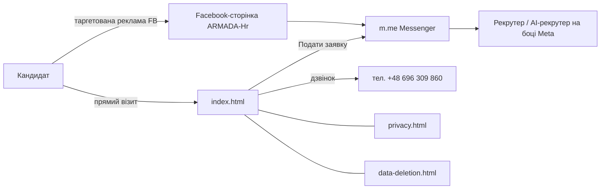
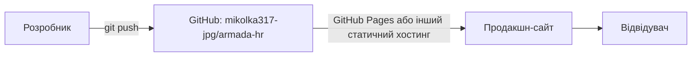

# ARMADA HR — повна технічна документація та база знань

> Останнє оновлення: 2026-07-12. Цей документ треба оновлювати при кожній зміні коду
> (автоматичного механізму оновлення в репозиторії немає — див. «Обмеження»).

---

## 1. Загальний опис

**Що це:** статичний вебсайт рекрутингової агенції **ARMADA HR**, яка працевлаштовує
українців у готелях Польщі.

**Для чого:** вітрина вакансій + обов'язкові сторінки для реклами в Meta
(політика конфіденційності та видалення даних — вимога Facebook для бізнес-сторінок
і додатків). Кандидати не реєструються на сайті — весь контакт іде через
Facebook Messenger і телефон.

**Бізнес-логіка:**
- Готелі-партнери: **Mercure Szczyrk Resort** (Щирк) та **Aries Hotel & Spa** (Вісла).
- Вакансії та ставки (zł/год нетто): кухар **32–35**, кухар сніданків 27–30,
  офіціант 26–29, бармен 27–31, покоївка 25–27, посудомийник 25.
- Графік змін: **тільки 6/1 або 5/2** (вимога власника — не змінювати).
- Житло: кімната поблизу готелю, **500 zł/міс** (платне!).
- Харчування: безкоштовне на робочих змінах.
- Договори: umowa o pracę (UoP) або umowa zlecenie.
- Заявки: Messenger (m.me) або телефон.

**Як працює:** відвідувач → головна сторінка → кнопка «Подати заявку» → якір `#contact`
→ Messenger/телефон. Жодного сервера, форм, JS чи збору даних на самому сайті немає.

---

## 2. Структура проєкту

```
armada-hr/
├── README.md            — короткий опис репозиторію
├── DOCS.md              — цей документ (повна документація)
├── index.html           — головна сторінка (єдина «складна» сторінка)
├── privacy.html         — політика конфіденційності (вимога Meta)
└── data-deletion.html   — інструкція видалення даних (вимога Meta)
```

Інших папок, конфігів, prихованих файлів немає (перевірено `ls -la`; є лише `.git`).

**index.html** (~190 рядків): шапка з навігацією, hero-блок із бейджами,
золотий промо-банер «Шукаємо кухарів» (`#promo-chefs`), сітка з 6 карток вакансій
(`#vacancies`), блок переваг (`#perks`), контакти (`#contact`), футер.
Увесь CSS — інлайновий у `<style>`; JavaScript відсутній повністю.

**privacy.html / data-deletion.html**: прості текстові сторінки зі спільним стилем
(CSS продубльований у кожній — прийнятно для 2 сторінок без системи збірки).

---

## 3. Архітектура

| Компонент | Стан |
|---|---|
| Frontend | Чистий HTML5 + CSS3, без фреймворків, без JS, без збірки |
| Backend | **Відсутній** (і не потрібен) |
| Database | **Відсутня** — дані кандидатів живуть у Messenger/телефоні |
| API | **Відсутнє** |
| Workers / Cron / Queues / Events / Webhooks | **Відсутні** |
| Authentication / Authorization | **Відсутні** — публічний сайт без кабінетів |
| AI-агенти в коді | **Відсутні** (на сторінці згадано «AI-рекрутер Андріана» — це працює на боці Facebook, не в цьому репозиторії) |
| Docker / CI/CD | **Відсутні** |
| Залежності (npm/pip тощо) | **Нуль** — карта залежностей порожня, конфліктів і вразливих пакетів бути не може |

### Mermaid — архітектура і потік користувача





---

## 4. API / Database / Environment

- **API-ендпоінтів немає.**
- **Таблиць БД, міграцій, індексів, RLS-політик немає.**
- **`.env` файлів немає і жодних змінних середовища не потрібно.**
- **Секретів у репозиторії немає** (перевірено пошуком по ключах/токенах — чисто).

---

## 5. Інтеграції (зовнішні сервіси)

| Сервіс | Де | Для чого | Що налаштувати |
|---|---|---|---|
| **Facebook / Meta** | посилання в `index.html`, `privacy.html`, `data-deletion.html` | сторінка компанії, Messenger-заявки, таргетована реклама | доступ до бізнес-сторінки; при рекламі — категорія «Працевлаштування» |
| Messenger (m.me/1144940712040972) | усі 3 сторінки | канал заявок | звірити ID (див. «Ризики» №1) |
| Телефон +48 696 309 860 | `index.html` (`tel:`) | канал заявок | — |
| **GitHub** | репозиторій `mikolka317-jpg/armada-hr` | зберігання коду, хостинг (Pages) | увімкнути Pages, якщо ще не ввімкнено |
| **Canva** | поза репозиторієм | банер реклами кухарів: https://www.canva.com/d/JZ29sSWR3OnWu9o | акаунт власника |
| **Gmail** | поза репозиторієм | чернетки рекламних текстів (лист «🔥 ФІНАЛ…» та чернетка по медсестрах) | акаунт mikolka317@gmail.com |
| Локальний скрипт `fb_poster.py` | на ПК власника (`Desktop\ai-recruiter\`), НЕ в репозиторії | автопублікація дописів у FB через Graph API | Page Access Token — зберігати поза git! |

OpenAI, Supabase, Stripe, Telegram, AWS, Cloudflare, Vercel, Docker тощо — **не використовуються**.

---

## 6. Аудит: знайдене і виправлене

### Виправлено автоматично (2026-07-12)
| Файл | Проблема | Виправлення |
|---|---|---|
| `privacy.html`, `data-deletion.html` | немає `<meta viewport>` — на телефоні сторінки відкривались дрібним «десктопним» масштабом | додано viewport |
| `index.html` | немає Open Graph метатегів — при шері в FB (основний канал!) прев'ю збиралося з випадкового тексту | додано og:title/description/type/locale |
| `index.html` | немає favicon — зайвий 404-запит, порожня іконка вкладки | додано SVG-емодзі ⚓ (data URI, без файлів) |
| всі 3 | зовнішні посилання без `target="_blank" rel="noopener noreferrer"` | додано (захист від reverse tabnabbing + не втрачаємо відвідувача) |
| `index.html` | футер «© 2025» | → 2026 |
| `README.md` | був порожній (один рядок) | повноцінний опис |

### Потребує рішення власника (НЕ виправляв — може зачепити бізнес)
1. **⚠️ Розбіжність Facebook ID.** Сайт посилається на сторінку
   `profile.php?id=122111671502001575` і Messenger `m.me/1144940712040972`,
   але адмін-панель сторінки ARMADA-Hr відкривалася за `profile.php?id=61550126786813`.
   Це можуть бути різні сторінки. Перевірити вручну: відкрити обидва посилання з сайту
   і переконатися, що вони ведуть на актуальну сторінку. Зовнішня мережа з цього
   середовища заблокована, тому перевірити сам не міг.
2. **Дата в privacy.html:** «набрання чинності 1 червня 2025» — застаріла? Оновити за бажанням.
3. **privacy.html обіцяє** «захищені сервери» і зберігання 12 міс — фактично дані живуть
   у Messenger. Формулювання варто узгодити з реальністю (юридична косметика).

### Чого НЕ знайдено (бо нема де взятися)
Race conditions, memory leaks, N+1, циклічні залежності, deprecated API, вразливі пакети,
XSS/SQLi/SSRF/RCE-поверхні — відсутні: немає ані JS, ані сервера, ані залежностей.
Dead code не виявлено: кожен CSS-клас з `index.html` використовується в розмітці (перевірено).

---

## 7. Security-аудит (підсумок)

- Секретів/ключів/паролів у коді — **немає** ✅
- Кукі, сесій, авторизації — немає → CSRF/сесійні атаки незастосовні ✅
- Інлайн-JS відсутній, форм немає → XSS-поверхня практично нульова ✅
- Зовнішні лінки тепер з `rel="noopener noreferrer"` ✅
- HTTPS: забезпечується хостингом (GitHub Pages дає автоматично) ✅
- **Головний актив, який треба берегти — не сайт, а:** доступ до Facebook-сторінки
  (2FA обов'язково!) та Page Access Token у локальному `fb_poster.py` —
  його **не можна** комітити в git.
- Обмеження GitHub Pages: не можна виставити власні security-заголовки
  (CSP, X-Frame-Options). Для цього сайту ризик прийнятний.

---

## 8. Performance

Сторінка — один HTML-файл ~11 КБ без зовнішніх ресурсів: **швидше практично не буває**
(один HTTP-запит, жодних блокуючих скриптів). Оптимізації не потрібні.
Єдине, що додасть кілька мс — стиснення на хостингу (GitHub Pages вже робить gzip).

---

## 9. INSTALL — від чистого комп'ютера до продакшну

**Локально (перегляд/правки):**
1. Встановити git → `git clone https://github.com/mikolka317-jpg/armada-hr.git`
2. Відкрити `index.html` подвійним кліком у браузері. Все.
   (Опційно локальний сервер: `python -m http.server 8000` → http://localhost:8000)

**Продакшн (GitHub Pages, безкоштовно):**
1. GitHub → репозиторій → Settings → Pages
2. Source: `Deploy from a branch`, Branch: `main`, папка `/ (root)` → Save
3. Через ~2 хв сайт живе на `https://mikolka317-jpg.github.io/armada-hr/`
4. (Опційно) свій домен: додати CNAME-файл і A/CNAME-записи в DNS.

**Backup:** git-історія на GitHub і є бекапом; додатково можна завантажити
Code → Download ZIP. **Restore:** `git checkout <commit>` або повторний clone.

**Оновлення контенту:** правиш HTML → commit → push у `main` → Pages оновиться сам.

---

## 10. CHANGELOG

| Дата | Файл(и) | Що змінено | Причина | Результат |
|---|---|---|---|---|
| 2026-07-10 | index.html | Додано промо-банер «Шукаємо кухарів» (32–35 zł/год), ставку картки «Кухар» 28–32→32–35, бейдж hero 25–32→25–35 | нова рекламна кампанія кухарів | перевірено скриншотами (десктоп+мобайл) |
| 2026-07-12 | privacy.html, data-deletion.html | + meta viewport | мобільний рендеринг | перевірено: горизонтального скролу немає |
| 2026-07-12 | index.html | + OG-теги, favicon, © 2026 | шеринг у FB, косметика | рендер без помилок консолі |
| 2026-07-12 | всі 3 html | зовнішні лінки: target=_blank + noopener | безпека/UX | перевірено |
| 2026-07-12 | README.md, DOCS.md | повна документація | цей аудит | — |

---

## 11. ПОВНА БАЗА ЗНАНЬ ПРОЄКТУ

**Архітектура:** 3 статичні HTML-сторінки, нуль залежностей, нуль інфраструктури.
Хостинг — будь-який статичний (ціль: GitHub Pages).

**Всі підключення/канали:**
- Facebook-сторінка ARMADA-Hr (адмін-доступ у власника; ID звірити — ризик №1)
- Messenger: https://m.me/1144940712040972
- Телефон: +48 696 309 860
- Репозиторій: github.com/mikolka317-jpg/armada-hr (робоча гілка змін:
  `claude/armada-chef-banner-9mb3qi`; основна: `main`)

**Секрети, які існують у власника (НЕ в репозиторії, значення не розкривати):**
- Facebook Page Access Token — у локальному `fb_poster.py` на ПК власника
- Паролі акаунтів: Facebook, GitHub, Gmail (mikolka317@gmail.com), Canva

**Рекламні матеріали (поза git):**
- Банер кухарів: Canva https://www.canva.com/d/JZ29sSWR3OnWu9o (940×788, фірмові кольори)
- Тексти реклами кухарів (допис + опис роботи + FAQ + налаштування таргету):
  чернетка Gmail «🔥 ФІНАЛ (публікувати цю)»
- Заготовка оголошення медсестер: чернетка Gmail «📝 ЧЕРНЕТКА… медсестра»
  (чекає 6 фактів від власника: ставка, місто, тип закладу, мова, житло, досвід)

**Незмінні бізнес-правила (підтверджені власником):**
- Графік змін: **тільки 6/1 або 5/2** — ніяк інакше
- Ставка кухарів: 32–35 zł/год нетто
- Житло 500 zł/міс — платне, у рекламі не називати безкоштовним
- Реклама вакансій у Meta — тільки з категорією «Особлива категорія → Працевлаштування»

**Фірмовий стиль:** темно-синій `#1a1a2e` (+`#16213e`, `#0f3460`), золотий `#f0a500`
(hover `#e09400`), шрифт Segoe UI/Arial. Використовувати в усіх банерах.

**Критичні точки відмови:**
1. Втрата доступу до Facebook-сторінки = втрата єдиного каналу заявок → увімкнути 2FA,
   додати другого адміна.
2. Неправильний FB ID на сайті (ризик №1) = заявки йдуть «в нікуди».
3. Видалення репозиторію = втрата сайту → git-клон на локальному ПК як бекап.

**Особливості/обмеження:**
- Немає системи аналітики (Pixel/GA). Якщо запускатимете таргет «на сайт» —
  без Meta Pixel не буде оптимізації конверсій; поки ціль реклами «Повідомлення»,
  Pixel не потрібен.
- Документація оновлюється вручну: після кожної зміни коду — оновити CHANGELOG
  і відповідний розділ тут. Автоматичного механізму немає (для статичного сайту
  без CI це свідоме рішення; за потреби можна додати GitHub Action-нагадування).
- CSS продубльований у privacy/data-deletion — не чіпати без потреби, це дешевше
  за спільний файл при двох сторінках.

**Місця особливої уваги при подальшій розробці:**
- Міняючи ставки — міняти УСІ місця: картка вакансії, бейдж hero, промо-банер,
  Canva-банер, чернетки Gmail (легко розсинхронізувати).
- `#promo-chefs` банер прив'язаний до кампанії кухарів — після закриття вакансії
  прибрати або замінити.
- Якір-навігація (`#vacancies`, `#perks`, `#contact`) — при перейменуванні секцій
  оновити і `<nav>`.
