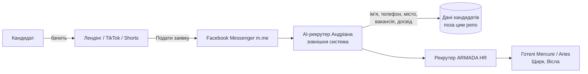
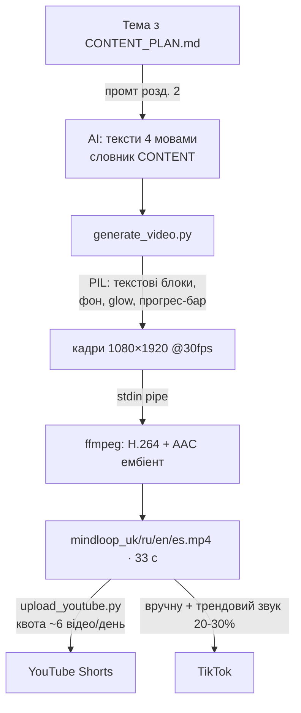
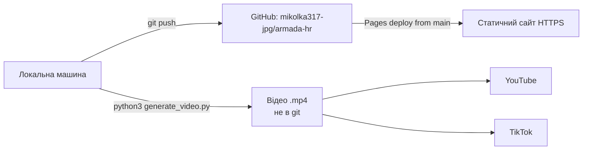

# ARMADA HR — Повна технічна документація та база знань

> Версія: 1.0 · Дата аудиту: 2026-07-12 · Гілка: `claude/video-creation-channel-setup-79za6k`
>
> Цей документ — єдине джерело правди про проєкт. Він створений за результатами
> повного аудиту кожного файлу репозиторію. Розділи, для яких у проєкті немає
> відповідного шару (backend, база даних тощо), чесно позначені **N/A** із
> поясненням — у проєкті цього немає, і документація цього не вигадує.

---

## 1. Загальний опис

**Що це.** ARMADA HR — рекрутингове агентство, що працевлаштовує українців у
готелях Польщі (Mercure Szczyrk Resort та Aries Hotel & Spa, міста Щирк і
Вісла). Репозиторій містить два незалежні продукти:

1. **Статичний лендінг** (3 HTML-сторінки) — вітрина вакансій з CTA на
   Facebook Messenger. Сторінки privacy/data-deletion існують як обов'язкова
   вимога Meta для Facebook App (AI-рекрутер «Андріана» працює в Messenger).
2. **Shorts Studio** (`shorts-studio/`) — генератор вірусних вертикальних
   відео для TikTok/YouTube Shorts у 4 мовах (укр/рос/англ/ісп) + контент-план
   + скрипт автозавантаження на YouTube. Це новий напрям (канал MINDLOOP,
   загальна вірусна ніша «психологія/факти про мозок»).

**Як працює бізнес-логіка.** Кандидат бачить лендінг або відео → тисне
«Подати заявку» → потрапляє в Facebook Messenger (`m.me/1144940712040972`) →
з ним спілкується AI-рекрутер «Андріана» (зовнішня система, НЕ в цьому
репозиторії) → збираються дані: ім'я, телефон, місто, вакансія, досвід
(перелік — з privacy.html).

**Технології:** чистий HTML/CSS без збірки та JS; Python 3 + Pillow + numpy +
ffmpeg для відеогенерації; YouTube Data API v3 для завантаження.

---

## 2. Структура репозиторію

```
armada-hr/
├── README.md               # Огляд проєкту, швидкий старт
├── DOCUMENTATION.md        # Цей документ
├── robots.txt              # Дозвіл індексації (User-agent: * / Allow: /)
├── index.html              # Лендінг: hero, 6 вакансій, 6 переваг, контакти
├── privacy.html            # Політика конфіденційності (вимога Meta)
├── data-deletion.html      # Інструкція видалення даних (вимога Meta)
└── shorts-studio/
    ├── README.md           # Швидкий старт студії
    ├── CONTENT_PLAN.md     # Дослідження алгоритмів 2026, формула, промт,
    │                       # контент-план на 30 днів, метадані, джерела
    ├── generate_video.py   # Генератор відео 9:16 1080×1920, 33 с, 4 мови
    ├── upload_youtube.py   # Завантаження на YouTube (OAuth + Data API v3)
    └── .gitignore          # Виключає секрети (client_secret.json, token.json),
                            # рендери (*.mp4, out/) та __pycache__
```

**Опис ключових файлів:**

- `index.html` (185 рядків) — самодостатній: усі стилі інлайн у `<style>`,
  жодного JS, жодних зовнішніх запитів (шрифти системні). Секції:
  `#vacancies` (6 карток вакансій із зарплатами 25–32 zł/год нетто),
  `#perks` (договір, житло 500 zł/міс, харчування, документи PESEL,
  курортний регіон, підтримка 24/7), `#contact` (Messenger, Facebook,
  телефон +48 696 309 860).
- `generate_video.py` — структура: словник `CONTENT` (тексти 4 мов із
  `*акцентами*`) → пре-рендер текстових блоків (PIL) → покадрова композиція
  (генератор, кадри йдуть у ffmpeg через stdin-pipe, без тимчасових PNG) →
  H.264 + AAC (ембіент-пад генерується виразом `aevalsrc`).
- `upload_youtube.py` — OAuth Desktop flow → `videos.insert` (resumable
  upload, категорія 27 Education, privacyStatus=public).

---

## 3. Архітектура

| Шар | Стан | Деталі |
|-----|------|--------|
| Frontend | ✅ | 3 статичні HTML-сторінки, mobile-first, без JS і залежностей |
| Backend | **N/A** | Немає. Уся динаміка — на боці Meta (Messenger-бот) |
| Database | **N/A** | Немає. Дані кандидатів живуть у зовнішній системі AI-рекрутера |
| Власне API | **N/A** | Немає endpoint-ів. Використовуються лише зовнішні API |
| Workers / Cron / Queues / Events / Webhooks | **N/A** | Немає |
| Storage | **N/A** | Рендери відео — локальні файли, у git не потрапляють |
| Authentication | Частково | Тільки OAuth 2.0 до YouTube (Desktop flow, токен у `token.json`) |
| Authorization | **N/A** | Публічний сайт без ролей |
| AI | Зовнішній + генеративний | Див. розділ 8 |
| Docker / CI/CD | **N/A** | Немає. Деплой = статичний хостинг |

---

## 4. API

**Власних endpoint-ів немає.** Зовнішні API, які використовує проєкт:

| API | Метод/Виклик | Де | Авторизація | Призначення |
|-----|--------------|----|-------------|-------------|
| YouTube Data API v3 | `videos.insert` (resumable POST) | `upload_youtube.py` | OAuth 2.0, scope `youtube.upload` | Публікація Shorts |
| Facebook Messenger deep-link | `https://m.me/1144940712040972` | усі 3 HTML | — | Вхід кандидата в діалог з ботом |
| Facebook Page | `facebook.com/profile.php?id=122111671502001575` | index.html | — | Сторінка компанії |
| `tel:+48696309860` | deep-link | index.html | — | Дзвінок |

Ліміт YouTube API: квота за замовчуванням 10 000 units/день; `videos.insert`
коштує 1600 units → **максимум ~6 завантажень на день** без запиту на
підвищення квоти. Це найважливіше практичне обмеження автозавантаження.

---

## 5. Database

**N/A.** У репозиторії немає таблиць, міграцій, індексів, RLS чи політик.
⚠️ **Важливо знати:** privacy.html обіцяє зберігання даних кандидатів
12 місяців і видалення за 72 години. Ці обіцянки має виконувати зовнішня
система (Messenger-бот «Андріана») — власник проєкту повинен знати, де
фізично лежать ці дані. У цьому репозиторії відповіді немає — це
задокументована прогалина знань (див. Knowledge Base, п. «Критичні точки»).

---

## 6. Environment / Секрети

Файлів `.env*` у проєкті немає і вони не потрібні. Повний перелік секретів:

| Файл | Що це | Як отримати | У git? |
|------|-------|-------------|--------|
| `shorts-studio/client_secret.json` | OAuth Client ID (Desktop) Google Cloud | Console → APIs → Credentials | ❌ у .gitignore |
| `shorts-studio/token.json` | Токен користувача (створюється при 1-му запуску) | автоматично | ❌ у .gitignore |

Перевірено: у поточному дереві та в усій git-історії (4 коміти) секретів,
ключів чи паролів немає.

---

## 7. Інтеграції

| Сервіс | Стан | Де | Що потрібно налаштувати |
|--------|------|----|--------------------------|
| **Meta / Facebook** | ✅ активна | Лендінг → Messenger; privacy/data-deletion — вимога Meta App Review | Сторінка FB і бот вже існують; при зміні сторінки оновити ID у 3 HTML-файлах |
| **YouTube (Google)** | ⚙️ готова до налаштування | `upload_youtube.py` | Google Cloud проєкт → увімкнути YouTube Data API v3 → OAuth Desktop client → `client_secret.json`; `pip install google-api-python-client google-auth-oauthlib` |
| **TikTok** | ✋ вручну | Публікація через застосунок | Створити акаунти (@mindloop.ua тощо). Content Posting API потребує окремого схвалення dev-акаунта — на старті не потрібен |
| **GitHub** | ✅ | Хостинг коду, `mikolka317-jpg/armada-hr` | Для хостингу сайту: Settings → Pages → deploy from branch `main` |
| OpenAI / Claude API / Gemini / Supabase / Firebase / Stripe / Telegram / Discord / Slack / AWS / Cloudflare / Vercel / Railway / Render / Docker | **N/A** | Не використовуються | — |

---

## 8. AI

1. **AI-рекрутер «Андріана»** — згадується на лендінгу («відповідає 24/7»).
   Живе на боці Facebook Messenger. Промптів, коду чи конфігурації в цьому
   репозиторії **немає** — це зовнішня система (ймовірно, платформа
   чат-ботів або Claude/GPT-інтеграція, налаштована окремо).
2. **Генеративний конвеєр Shorts Studio** — без виклику AI-API в рантаймі:
   тексти сюжетів генеруються AI-асистентом за промтом із
   `CONTENT_PLAN.md` (розділ 2), рендер — детермінований Python-код.
   Формула відео (з дослідження алгоритмів 2026): контраріанський хук 0–3 с →
   4 факти з плашками n/4 (open loop) → CTA, що зациклює перегляд.
3. Memory / RAG / Embeddings / MCP / Vector DB — **N/A**.

---

## 9. Deployment

**Локально:** `python3 -m http.server 8080` (сайт); `python3
shorts-studio/generate_video.py all out/` (відео; потрібні ffmpeg, pillow,
numpy, шрифт DejaVu).

**Production (сайт):** будь-який статичний хостинг. Рекомендація —
GitHub Pages (безкоштовно): Settings → Pages → Branch `main` → root.
Посилання в HTML відносні, тому сайт працює і на `user.github.io/armada-hr/`,
і на власному домені. Кастомний домен: файл `CNAME` + DNS A/CNAME записи.

**CI/CD:** відсутній і на поточному масштабі не потрібен. Якщо з'явиться
збірка — достатньо GitHub Actions з deploy на Pages.

**Backup/Restore:** уся цінність — у git (GitHub = офсайт-копія). Рендери
відео відтворювані заново з коду. Єдине, що треба берегти окремо:
`client_secret.json`/`token.json` (перевипускаються в Google Cloud) і дані
кандидатів у зовнішній системі бота.

---

## 10. Security — повний аудит

**Поверхня атаки мінімальна:** статичний сайт без JS, форм, кукі, сесій та
серверного коду. Тому SQLi, XSS (введення), CSRF, SSRF, RCE, Path Traversal,
Command Injection, Rate Limit, Session/JWT, CORS, File Upload, Open Redirect,
Serialization — **непридатні** (немає відповідних механізмів).

Що перевірено і що зроблено:

| Перевірка | Результат |
|-----------|-----------|
| Hardcoded secrets (дерево + вся git-історія) | ✅ Чисто |
| Reverse tabnabbing (зовнішні лінки без `noopener`) | 🔧 **Виправлено**: `rel="noopener noreferrer"` на всіх зовнішніх посиланнях |
| Витік OAuth-секретів YouTube через git | 🔧 **Виправлено**: `client_secret.json`, `token.json` додані в .gitignore ДО першого використання |
| Command Injection у `generate_video.py` | ✅ Безпечно: subprocess зі списком аргументів, без shell=True, без користувацького вводу |
| Залежності (pillow, numpy, google-api-python-client) | ✅ Актуальні мажорні версії; сайт залежностей не має взагалі |
| Sensitive logging / debug | ✅ Немає |
| PII на сторінках | ✅ Лише публічні контакти компанії |

**Залишкові ризики та рекомендації (не застосовано автоматично):**

1. **Security headers** (CSP, X-Content-Type-Options, Referrer-Policy) — на
   статичному хостингу задаються платформою; на GitHub Pages недоступні.
   Ризик низький (немає JS). Якщо переїдете на Cloudflare Pages — додати.
2. **`privacyStatus="public"` в upload_youtube.py** — перше тестове
   завантаження краще робити зі значенням `unlisted` (свідомо не змінив:
   зміна бізнес-поведінки; поміняйте один рядок за бажанням).
3. **HTTPS** — переконайтесь, що хостинг видає сертифікат (Pages — так).

---

## 11. Bugs — знайдено та виправлено

| # | Проблема | Серйозність | Статус |
|---|----------|-------------|--------|
| 1 | `.gitignore` не покривав OAuth-секрети YouTube | 🔴 Критично (превентивно) | ✅ Виправлено |
| 2 | Немає `<meta viewport>` у privacy.html та data-deletion.html → сторінки нечитабельні на мобільних (а саме туди веде Facebook) | 🟠 Високо | ✅ Виправлено |
| 3 | Абсолютні посилання `/privacy.html`, `/` ламаються при деплої в підпапку (GitHub Pages project site) | 🟠 Високо | ✅ Виправлено (відносні) |
| 4 | Зовнішні посилання без `noopener` | 🟡 Середньо | ✅ Виправлено |
| 5 | Помилки ffmpeg губилися (stderr → DEVNULL), BrokenPipeError ховав причину падіння | 🟡 Середньо | ✅ Виправлено (лог + хвіст у виняток) |
| 6 | Мертвий імпорт `ImageFilter` | ⚪ Низько | ✅ Прибрано |
| 7 | Немає favicon (404 у консолі, порожня вкладка) | ⚪ Низько | ✅ Додано (інлайн SVG, без зовнішніх запитів) |
| 8 | Немає OG-тегів → потворні прев'ю при шерингу в Messenger/FB (критично для рекрутингу через соцмережі) | 🟡 Середньо | ✅ Додано |
| 9 | `© 2025` застарілий; порожній README; немає robots.txt | ⚪ Низько | ✅ Виправлено |

**Що залишилось зробити (свідомо не автоматизовано):**
- OG-теги вказують локаль, але немає `og:image` — потрібна реальна картинка
  1200×630 (можу згенерувати за запитом).
- Рішення, де саме хоститься сайт (Pages? інший хостинг?) — від цього
  залежить потреба в CNAME.

## 12. Performance

- Лендінг: 0 зовнішніх запитів, 0 JS, ~9 КБ HTML — LCP визначається лише
  хостингом. Оптимізувати нічого.
- Генератор відео: 33 с × 30 fps × 4 мови ≈ 4000 кадрів рендериться за
  ~28 с/мова завдяки пре-рендеру текстових блоків і піпінгу сирих кадрів у
  ffmpeg без проміжних PNG (це і є головна оптимізація; наївний підхід
  «PNG на кадр» був би у 5–10 разів повільніший і з'їдав би ~500 МБ диска).
- Можливе прискорення (за потреби): `-preset fast`, паралельний рендер мов
  (4 процеси), зниження fps до 24. Зараз не потрібно.

## 13. Карта залежностей

```mermaid
graph TD
    subgraph "Сайт (без залежностей)"
        IDX[index.html] --> PRV[privacy.html]
        IDX --> DEL[data-deletion.html]
        PRV --> DEL
        IDX -- "m.me deep-link" --> FB[Facebook Messenger<br/>AI-рекрутер Андріана]
        PRV -- "запит на видалення" --> FB
    end
    subgraph "Shorts Studio"
        GEN[generate_video.py] --> PIL[pillow]
        GEN --> NP[numpy]
        GEN --> FF[ffmpeg (система)]
        GEN --> FNT[DejaVu Sans Bold (система)]
        UPL[upload_youtube.py] --> GAPI[google-api-python-client]
        UPL --> GAUTH[google-auth-oauthlib]
        UPL -- "OAuth 2.0 + videos.insert" --> YT[YouTube Data API v3]
        GEN -. "mp4" .-> UPL
        GEN -. "mp4 вручну" .-> TT[TikTok App]
    end
```

## 14. Mermaid-діаграми

**Архітектура і потік даних кандидата:**


**Конвеєр виробництва відео:**


**Deployment:**


## 15. INSTALL — з чистого комп'ютера до production

```bash
# 1. Базові інструменти (Ubuntu/Debian; на Mac: brew install git python3 ffmpeg)
sudo apt update && sudo apt install -y git python3 python3-pip ffmpeg fonts-dejavu-core

# 2. Клонування
git clone https://github.com/mikolka317-jpg/armada-hr.git && cd armada-hr

# 3. Сайт — перевірка локально
python3 -m http.server 8080        # відкрити http://localhost:8080

# 4. Сайт — production: GitHub → Settings → Pages → Branch: main, folder: /
#    (через ~1 хв сайт живе на https://mikolka317-jpg.github.io/armada-hr/)

# 5. Відеостудія
pip3 install pillow numpy
python3 shorts-studio/generate_video.py all out/   # 4 відео за ~2 хв

# 6. Автозавантаження на YouTube (одноразово ~10 хв)
#    console.cloud.google.com → новий проєкт → увімкнути "YouTube Data API v3"
#    → Credentials → OAuth client ID → Desktop app → завантажити JSON
#    → зберегти як shorts-studio/client_secret.json
pip3 install google-api-python-client google-auth-oauthlib
python3 shorts-studio/upload_youtube.py out/mindloop_uk.mp4 "Назва" "Опис" "теги,через,кому"
# перший запуск відкриє браузер для входу в Google; далі — без участі людини

# 7. TikTok: створити акаунт у застосунку, завантажити mp4,
#    ДОДАТИ трендовий звук на 20–30% гучності, опис з CONTENT_PLAN.md
```

## 16. CHANGELOG

| Дата | Файл | Зміна | Причина | Результат |
|------|------|-------|---------|-----------|
| 2026-07-12 | shorts-studio/* (нове) | Створено відеостудію: генератор, план, аплоадер | Запит: канал коротких відео | 4 відео зрендерено й перевірено |
| 2026-07-12 | shorts-studio/.gitignore | + client_secret.json, token.json, *.mp4, out/ | Захист секретів від коміту | Перевірено: git не бачить секретів |
| 2026-07-12 | privacy.html, data-deletion.html | + meta viewport | Нечитабельність на мобільних | HTML-валідація OK |
| 2026-07-12 | усі 3 HTML | Відносні посилання замість абсолютних | Ламались у підпапці хостингу | Лінк-чек: усі цілі існують |
| 2026-07-12 | усі 3 HTML | target=_blank + rel=noopener на зовнішні лінки | Reverse tabnabbing | Валідація OK |
| 2026-07-12 | index.html | + OG-теги, favicon (інлайн SVG), © 2025–2026 | Прев'ю в соцмережах, UX | Скріншот-тест OK |
| 2026-07-12 | generate_video.py | − ImageFilter; ffmpeg stderr → лог із хвостом у винятку | Dead code; діагностика падінь | py_compile OK; контрольний рендер: h264 1080×1920 33 с + aac ✅ |
| 2026-07-12 | README.md, robots.txt, DOCUMENTATION.md | Створено/заповнено | Порожній README; SEO; база знань | — |

**Правило ведення:** кожна наступна зміна коду супроводжується рядком у цій
таблиці та оновленням відповідного розділу документа (це найпростіший
надійний механізм «автооновлення» для репозиторію без CI; якщо з'явиться
CI — додати перевірку, що PR, який змінює код, змінює і DOCUMENTATION.md).

---

## 17. ПОВНА БАЗА ЗНАНЬ ПРОЄКТУ

**Суть у трьох реченнях.** Статичний сайт-вітрина рекрутингу в Польщу, весь
збір даних — через Facebook Messenger із зовнішнім AI-ботом. Окремо —
самодостатній Python-конвеєр виробництва вірусних відео MINDLOOP для
TikTok/Shorts у 4 мовах. Жодного сервера, бази чи секрету в репозиторії немає.

**Зовнішні сервіси та ідентифікатори:**
- Facebook Page ID: `122111671502001575`; Messenger: `m.me/1144940712040972`
- Телефон компанії: +48 696 309 860
- GitHub: `mikolka317-jpg/armada-hr`; робоча гілка `claude/video-creation-channel-setup-79za6k`, основна — `main`
- Секрети, які потрібно мати (значення — тільки локально): OAuth client
  Google Cloud (`client_secret.json`) і токен (`token.json`)

**Сценарії запуску:** сайт — відкрити HTML або `python3 -m http.server`;
відео — `python3 shorts-studio/generate_video.py [uk|ru|en|es|all] out/`;
публікація — `upload_youtube.py` (YouTube) або вручну (TikTok).

**Нестандартні рішення:**
- Кадри йдуть у ffmpeg сирим потоком через stdin (без PNG) — швидкість.
- Аудіо синтезується виразом `aevalsrc` — немає ліцензійних ризиків музики;
  кома всередині виразу мусить бути екранована `\\,` (уже зроблено).
- Акцентні слова в текстах відео позначаються `*зірочками*` у словнику `CONTENT`.
- Favicon — інлайн SVG data-URI, щоб сторінка лишалась без зовнішніх запитів.

**Відомі обмеження:**
- YouTube API: ~6 завантажень/день на стандартній квоті (1600 units × insert).
- TikTok — тільки ручна публікація (Content API вимагає схвалення).
- Шрифт DejaVu не має кольорових емодзі — у текстах відео емодзі не
  використовувати (у метаданих/описах — можна).
- Відео 33 с розраховане під пороги алгоритмів 2026 (65%/50% retention,
  зона 30–45 с) — не скорочувати нижче 30 с без перегляду формули.

**Критичні точки відмови / що потребує уваги:**
1. **Дані кандидатів живуть поза репозиторієм** (система бота «Андріана»).
   Обіцянки privacy.html (видалення за 72 год, зберігання 12 міс) виконуються
   там. При зміні бот-платформи — перевірити відповідність цим обіцянкам.
2. **Усі контакти захардкоджені у 3 файлах** — при зміні номера/сторінки FB
   шукати за `m.me/`, `facebook.com`, `tel:+48`.
3. `token.json` дає право завантажувати відео на канал — при витоку
   відкликати доступ: myaccount.google.com → Security → Third-party access.
4. Перед першим публічним аплоадом через API розглянути `privacyStatus:
   "unlisted"` для тесту (один рядок в upload_youtube.py).
5. Немає `og:image` — прев'ю шерингу без картинки, варто додати 1200×630.
6. Хостинг сайту ще не обраний/не підтверджений — інструкція для GitHub
   Pages у розділі 15, крок 4.

**Для наступного розробника або AI:** почни з цього документа, потім
`shorts-studio/CONTENT_PLAN.md` (там формула контенту і промт генерації
нових сюжетів). Нові сюжети відео = новий словник `CONTENT` у
`generate_video.py`. Не коміть mp4 і секрети — .gitignore вже налаштований.
Після будь-якої зміни коду онови CHANGELOG (розділ 16) і відповідний розділ.
