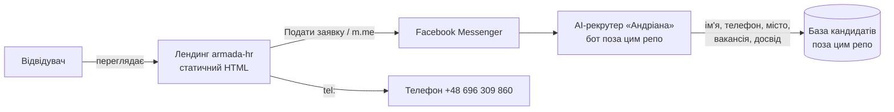

# ARMADA HR — лендинг для рекрутингу

Статичний сайт-візитка агенції **ARMADA HR**: працевлаштування українців у готелях Польщі (Mercure Szczyrk Resort, Aries Hotel & Spa — курорти Щирк і Вісла).

> Повна технічна документація та база знань проєкту. Останній аудит: 2026-07-12.

---

## 1. Загальний опис

**Що це:** статичний маркетинговий лендинг без бекенду. Три HTML-сторінки, весь CSS інлайновий, JavaScript відсутній.

**Для чого:**
- показ актуальних вакансій (кухар, кухар сніданків, офіціант, бармен, покоївка, посудомийник; ставки 25–32 zł/год нетто);
- збір заявок через **Facebook Messenger** (кнопка «Подати заявку» → `m.me/1144940712040972`);
- сторінки **Privacy Policy** та **Data Deletion** — обов'язкова вимога Meta для Facebook-застосунку / Messenger-бота.

**Як працює:** відвідувач відкриває сайт → тисне «Подати заявку» або «Написати в Messenger» → потрапляє в чат Facebook-сторінки, де відповідає AI-рекрутер «Андріана» (бот живе **поза цим репозиторієм** — див. розділ «Інтеграції»).

## 2. Структура

```
armada-hr/
├── index.html          — головна: hero, вакансії, умови, контакти, футер
├── privacy.html        — політика конфіденційності (вимога Meta)
├── data-deletion.html  — інструкція з видалення даних (вимога Meta)
├── og-image.png        — прев'ю 1200×630 для шерингу в соцмережах (og:image)
└── README.md           — цей документ
```

Кожна сторінка повністю самодостатня: свій `<style>` у `<head>`, нуль зовнішніх ресурсів (шрифтів, картинок, скриптів, CDN). Іконки — emoji.

## 3. Архітектура

| Шар | Стан |
|---|---|
| Frontend | 3 статичні HTML-сторінки, інлайн CSS, без JS, без збірки |
| Backend / API / Database / Workers / Cron / Queue / Auth | **відсутні** — сайту вони не потрібні |
| Форми / збір даних на сайті | відсутні — всі персональні дані збираються тільки в Messenger |
| AI | AI-рекрутер «Андріана» — окремий Messenger-бот, у цьому репозиторії його коду немає |

Потік даних:



## 4. Environment / секрети

Змінних оточення і секретів у репозиторії **немає** (перевірено аудитом: жодних ключів, токенів чи паролів у коді). Для деплою статичного сайту вони не потрібні.

Секрети, що існують **поза репозиторієм** (налаштовуються у відповідних сервісах, не в коді):
- доступ до Facebook-сторінки ARMADA HR і Meta App (Messenger-бот);
- токени/ключі платформи, на якій працює бот «Андріана».

## 5. Інтеграції

| Сервіс | Де використовується | Що потрібно налаштувати |
|---|---|---|
| **Facebook Messenger** | кнопки `https://m.me/1144940712040972` (index, privacy, data-deletion) | Facebook-сторінка має бути активна; у налаштуваннях Meta App вказати URL Privacy Policy та Data Deletion саме цього сайту |
| **Facebook Page** | посилання `facebook.com/profile.php?id=122111671502001575` | — |
| **Телефон** | `tel:+48696309860` | — |
| **AI-бот «Андріана»** | згадується в блоці «Підтримка 24/7» | живе окремо; при зміні платформи бота сайт міняти не треба, поки не зміниться ID сторінки |

Інших інтеграцій (OpenAI, Supabase, Stripe, аналітика тощо) на сайті немає.

## 6. Deployment

Репозиторій не містить конфігів деплою (немає CNAME, workflow, Dockerfile) — сайт розгортається як звичайна статика.

**GitHub Pages (рекомендовано):** Settings → Pages → Deploy from branch `main`, root. Сайт буде на `https://mikolka317-jpg.github.io/armada-hr/`. Внутрішні посилання зроблено відносними, тому сайт коректно працює і в підкаталозі project-page, і на власному домені.

**Локальний перегляд:** відкрити `index.html` у браузері або `python3 -m http.server 8000`.

**Backup/restore:** увесь сайт = вміст git-репозиторію; `git clone` — це і бекап, і відновлення.

⚠️ Після зміни URL сайту онови посилання на Privacy Policy / Data Deletion у налаштуваннях Meta App — інакше Meta може обмежити бота.

## 7. Security-аудит (2026-07-12)

- Секретів/ключів у коді немає. JS немає → немає XSS/CSRF-поверхні. Форм немає → сайт не обробляє персональні дані напряму. SQL/SSRF/RCE/uploads — незастосовно (немає бекенду).
- Зовнішні посилання без `target="_blank"` → ризик reverse tabnabbing відсутній.
- Публічні контакти (телефон, FB-сторінка) — розміщені свідомо.
- **Залишкові рекомендації:** якщо додасте форму чи JS-аналітику — додайте Content-Security-Policy; на GitHub Pages HTTPS вмикається автоматично, переконайтесь що «Enforce HTTPS» увімкнено.

## 8. Знайдені проблеми та виправлення (CHANGELOG аудиту)

| Дата | Файл | Що змінено | Причина | Результат |
|---|---|---|---|---|
| 2026-07-12 | index.html | `Aries Hotel & Spa` → `&amp;` | невалідний сирий `&` в HTML | валідний HTML |
| 2026-07-12 | index.html | футер: `/privacy.html`, `/data-deletion.html` → відносні | абсолютні шляхи ламаються на GitHub Pages project-site (вели б на 404) | посилання працюють на будь-якому хостингу |
| 2026-07-12 | privacy.html | + `<meta viewport>`; посилання зроблено відносними | сторінка рендерилась зменшеною на мобільних; ті самі 404 | коректний мобільний рендер |
| 2026-07-12 | data-deletion.html | + `<meta viewport>`; посилання на головну зроблено відносним | те саме | те саме |
| 2026-07-12 | README.md | заглушка → повна документація | вимога аудиту | цей файл |
| 2026-07-16 | index.html | редизайн (той самий контент і бренд-кольори): sticky-хедер, оновлені hero/картки/секції; CTA веде напряму в Messenger; + favicon (emoji data-URI), Open Graph теги, `© 2026` | рекомендації аудиту + запит власника | сучасніший вигляд, гарне прев'ю у Facebook |
| 2026-07-16 | og-image.png | новий файл 1200×630 | потрібен для og:image | прев'ю при шерингу |
| 2026-07-16 | privacy.html, data-deletion.html | + favicon, theme-color | консистентність | іконка у вкладці |

**Не виправлено свідомо (рішення за власником):**
- ~~`© 2025` у футері~~ — ✅ виправлено 2026-07-16.
- ~~Немає favicon~~ — ✅ додано 2026-07-16 (emoji ⚓ як SVG data-URI, без зовнішніх файлів).
- ~~Немає Open Graph тегів~~ — ✅ додано 2026-07-16 разом з `og-image.png`. ⚠️ `og:image` вказує на `https://mikolka317-jpg.github.io/armada-hr/og-image.png` — якщо сайт переїде на інший домен, онови URL у `index.html`.
- Заявлені перевірки «build/lint/tests» — незастосовні: збірки й тестів у проєкті немає; зроблено перевірку валідності HTML (пройдено).
- Доступність зовнішніх URL (m.me, facebook, github.io) з середовища аудиту не перевірялась — мережа до цих хостів закрита; перевір вручну, що сторінка FB активна і Pages увімкнено.

## 9. База знань проєкту (для наступного розробника / AI)

- **Критична точка відмови №1:** Facebook-сторінка `1144940712040972`. Якщо її заблокують — сайт втрачає єдиний канал заявок (крім телефону). ID зашитий у 3 файлах — при зміні сторінки шукай `m.me/` по всьому репо.
- **Критична точка №2:** сторінки privacy/data-deletion потрібні Meta для роботи бота. Не видаляй і не перейменовуй їх без оновлення URL у Meta App.
- **Особливість:** проєкт навмисно без залежностей — не додавай збірку/фреймворк без потреби; будь-яка зміна = правка HTML + push.
- **Зв'язок з репо `ai-recruiter`:** він існує в цьому ж акаунті, але **порожній** (0 комітів). Ймовірно, задумувався під код AI-рекрутера. Код бота «Андріана» станом на 2026-07-12 не знайдено в жодному з репозиторіїв акаунта.
- **Обмеження:** вакансії й ставки зашиті в HTML — оновлення цін = правка `index.html`, секція `#vacancies`.
